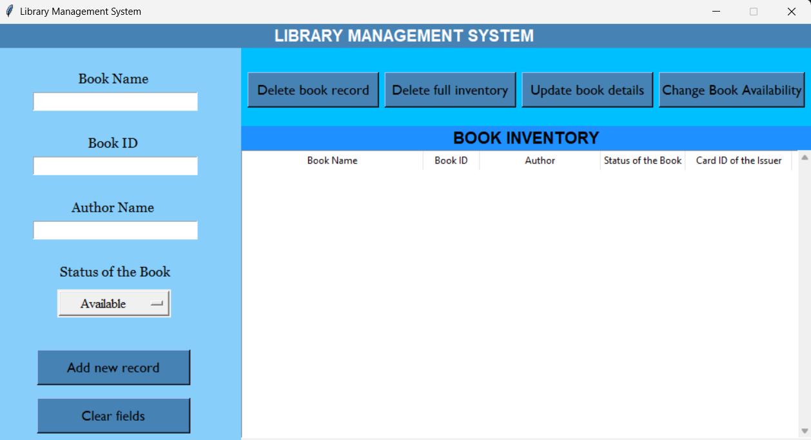

# Library Management System

A simple Library Management System built with Python and Tkinter, using SQLite for database management. The system allows users to manage books, including adding new books, viewing and updating book details, tracking the status of books (available or issued), and deleting books or the entire inventory.

## Features

- **Add new books** to the library with details such as book name, book ID, author name, and book status (Available or Issued).
- **View existing records** of books.
- **Update book details**, including availability and card ID of the issuer.
- **Change availability**: Mark a book as Issued or Available and track the card ID of the issuer.
- **Delete books** or **delete the entire inventory**.
- **Database**: Uses an SQLite database (`library.db`) to store the records.

## Technologies Used

- **Python**: The core programming language.
- **Tkinter**: For building the GUI.
- **SQLite**: For managing the database.

## Installation

1. Clone the repository to your local machine:
   ```bash
   git clone https://github.com/shiva0909122/Library-Management-System.git
   ```

2. Change directory to the project folder:
   ```bash
   cd Library-Management-System
   ```

3. Ensure you have Python installed on your machine. If not, download and install it from [python.org](https://www.python.org/).

4. Install Tkinter (if not already installed with Python):
   - On Windows, Tkinter is usually included with Python by default.
   - On Linux, you can install Tkinter using:
     ```bash
     sudo apt-get install python3-tk
     ```

5. Run the Python script:
   ```bash
   python major_project.py
   ```

## Usage

1. **Add Book**: Fill in the form with book details and click **Add new record**.
2. **View Book**: Select a book record from the table to view and modify.
3. **Update Book**: After selecting a record, click **Update book details** to make changes.
4. **Change Availability**: Use this to mark a book as Issued or Available.
5. **Delete Book**: Select a record and click **Delete book record** to remove it.
6. **Delete Full Inventory**: Remove all records from the database with this option.

## Database Schema

The database (`library.db`) uses the following table structure:

### Output



### Library Table:
- **BK_NAME** (TEXT): The name of the book.
- **BK_ID** (TEXT, PRIMARY KEY): A unique identifier for each book.
- **AUTHOR_NAME** (TEXT): The name of the book's author.
- **BK_STATUS** (TEXT): The current status of the book (`Available` or `Issued`).
- **CARD_ID** (TEXT): The ID of the cardholder (if the book is issued).
